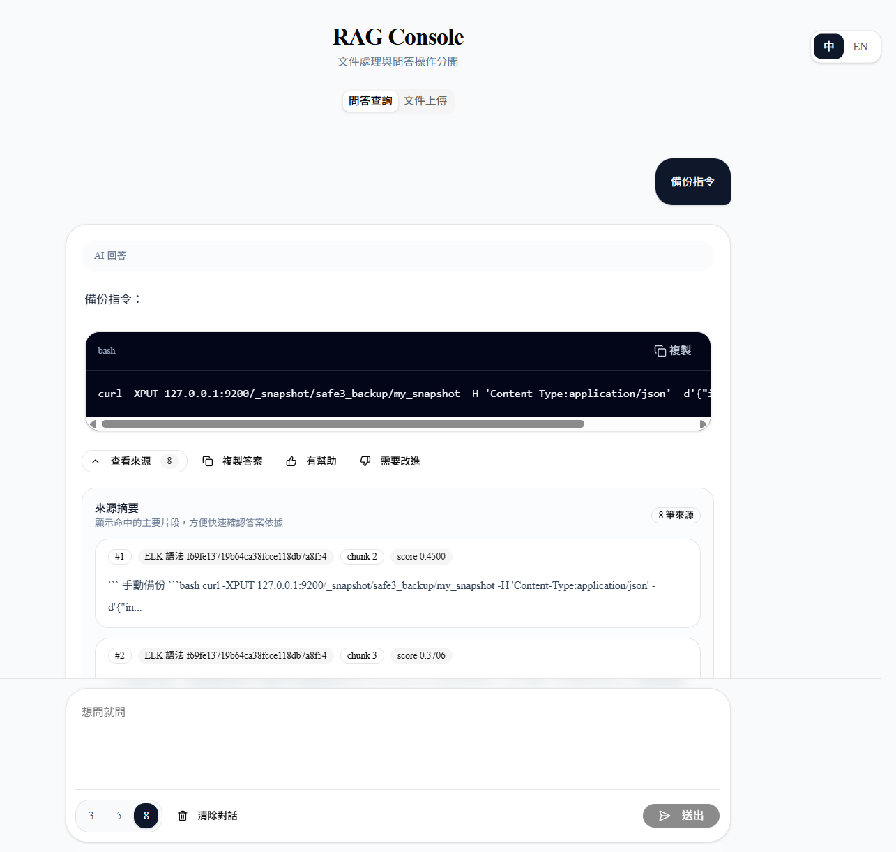
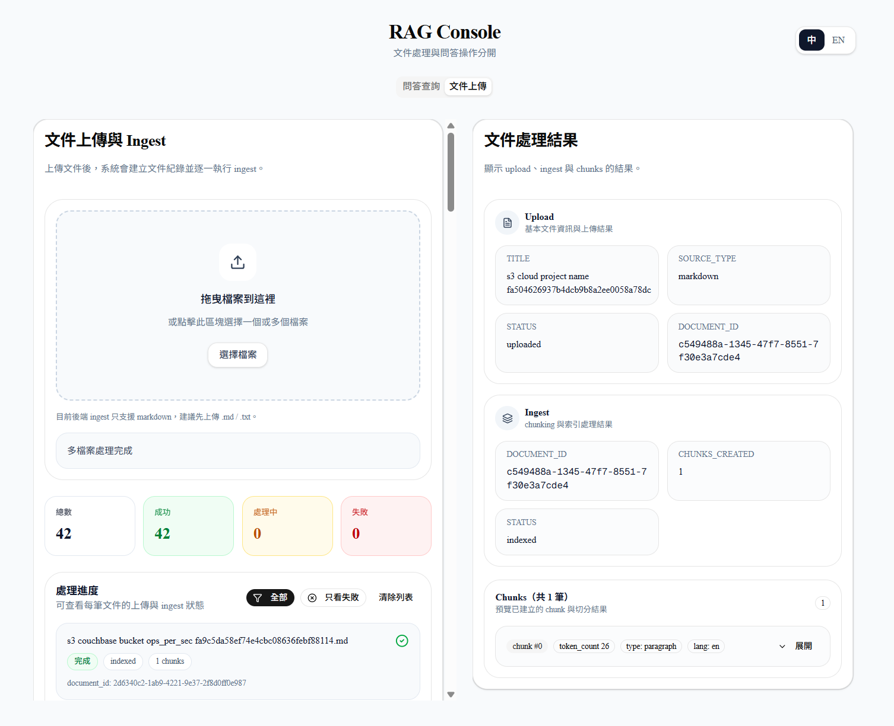

# RAG Console

A full-stack RAG (Retrieval-Augmented Generation) document Q&A system built with **FastAPI**, **PostgreSQL + pgvector**, and **Next.js**.

The project separates the workflow into two major areas:

- **Q&A**  
  Ask questions against ingested documents and inspect citations.
- **Upload / Ingest**  
  Upload files, create document records, ingest content, and preview generated chunks.

---

## Overview

This project is designed to provide an end-to-end RAG workflow:

1. Upload a document
2. Create a document record
3. Chunk the content
4. Generate embeddings
5. Store chunks and vectors in PostgreSQL / pgvector
6. Ask a question
7. Run query rewrite + hybrid retrieval
8. Generate an answer with citations
9. Submit feedback for answer quality

It is intended as both a practical RAG application and a reference architecture for document ingestion, retrieval, answer generation, and iterative search quality improvement.

---

## Features

### Backend
- FastAPI-based REST API
- PostgreSQL storage
- `pgvector` for vector similarity search
- Full-text search (FTS)
- Hybrid retrieval: FTS + vector search
- Query rewrite pipeline
- Search / QA tracking
- Feedback submission endpoint
- Alembic migrations

### Frontend
- Next.js App Router
- React
- TypeScript
- Tailwind CSS
- shadcn/ui
- Framer Motion
- `next-intl` i18n support
- Q&A interface
- Upload / ingest workflow
- Chunk preview UI
- Citation display
- Like / dislike feedback

### Retrieval / QA
- Query normalization / rewrite rules
- FTS retrieval
- Vector retrieval
- Hybrid score merge and reranking
- Citation-aware answer rendering

---

## UI Preview


### QA Page


Shows the chat-style Q&A flow, AI answer rendering, source citations, and feedback actions.

### Upload / Ingest Page


Shows multi-file upload, ingest progress, processing queue, and chunk preview for the selected document.

---

## System Flow

```mermaid
flowchart TD
    subgraph Ingestion Pipeline
        A[Upload document] --> B[Create document metadata]
        B --> C[Parse content]
        C --> D[Chunking]
        D --> E[Generate embeddings]
        E --> F[Save chunks]
        F --> G[Save vectors to PostgreSQL / pgvector]
    end

    subgraph Retrieval and QA Pipeline
        H[User question] --> I[Query rewrite service]
        I --> J[Search service]
        J --> K[Full-text retrieval]
        J --> L[Vector retrieval]
        K --> M[Hybrid ranking]
        L --> M
        M --> N[Top-K chunks]
        N --> O[QA service builds prompt]
        O --> P[LLM service generates answer]
        P --> Q[Answer with citations]
    end

    subgraph Feedback Pipeline
        Q --> R[User submits like / dislike]
        R --> S[Save feedback]
    end

    G --> J