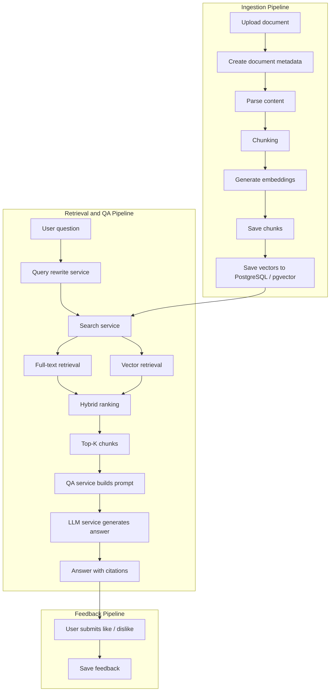

# Internal Docs RAG QA System

An end-to-end RAG (Retrieval-Augmented Generation) platform for internal document Q&A, built with **FastAPI**, **PostgreSQL + pgvector**, and **Next.js**.

This project demonstrates how to build a practical AI application beyond a simple chatbot UI. It covers the complete workflow of document ingestion, chunking, embeddings, hybrid retrieval, citation-backed answering, and feedback collection.

The project separates the workflow into two major areas:

- **Q&A**  
  Ask questions against ingested documents and inspect citations.
- **Upload / Ingest**  
  Upload files, create document records, ingest content, and preview generated chunks.

---

## Why I built this

In many internal systems, knowledge is scattered across PDFs, documents, manuals, and operational notes. Traditional keyword search often misses semantic intent, while pure vector search may lose exact-match signals.

This project explores a production-style RAG architecture that combines:

- document ingestion pipeline
- PostgreSQL full-text search
- pgvector semantic retrieval
- hybrid ranking
- citation-aware answer generation
- feedback loop for iterative search quality improvement

---

## Highlights

- End-to-end RAG workflow from upload to answer
- Hybrid retrieval with full-text search and vector similarity search
- Query rewrite pipeline for better recall
- Citation-backed answer rendering
- Chunk preview for ingestion inspection
- Feedback collection for answer quality analysis
- Full-stack implementation with backend and frontend integration

---

## Tech Stack

### Backend

- Python
- FastAPI
- PostgreSQL
- pgvector
- SQLAlchemy
- Alembic

### Frontend

- Next.js
- React
- TypeScript
- Tailwind CSS
- shadcn/ui
- Framer Motion
- next-intl

### Infra / Tooling

- Docker
- Docker Compose
- Shell script setup

---

## Core Features

### 1. Document Ingestion

Users can upload documents, create document records, parse content, generate chunks, and store both metadata and vector embeddings.

### 2. Hybrid Retrieval

The system combines:

- Full-Text Search for exact keyword matching
- Vector Search for semantic similarity
- Hybrid score merging and reranking for better relevance

### 3. Citation-backed QA

Answers are generated from retrieved chunks and rendered with source citations, helping users verify the supporting evidence.

### 4. Search Quality Improvement

The system includes:

- query rewrite / normalization
- QA tracking
- feedback submission

These components make the system easier to evaluate and improve over time.

---

## Architecture Overview

### Ingestion Pipeline

1. Upload document
2. Create document metadata
3. Parse content
4. Chunk content
5. Generate embeddings
6. Store chunks and vectors in PostgreSQL / pgvector

### Retrieval & QA Pipeline

1. User submits a question
2. Query rewrite / normalization
3. Full-text retrieval + vector retrieval
4. Hybrid ranking
5. Select top-K chunks
6. Build QA prompt
7. Generate answer
8. Render answer with citations

### Feedback Pipeline

1. User submits like / dislike feedback
2. Store feedback for later evaluation and tuning

---

## Repository Structure

```text
.
├── backend/
├── frontend/
├── docs/
│   └── images/
├── docker-compose.yml
└── setup_rag_stack.sh
```

---

## UI Preview


### QA Page


Shows the chat-style Q&A flow, AI answer rendering, source citations, and feedback actions.

### Upload / Ingest Page


Shows multi-file upload, ingest progress, processing queue, and chunk preview for the selected document.

---

## Quick Start

### 1. Clone the repository

```bash
git clone https://github.com/tim0515vcd/qa_system.git
cd qa_system
```

### 2. Configure environment variables

Create `backend/.env`:

```env
APP_ENV=dev
DEBUG=true

POSTGRES_USER=raguser
POSTGRES_PASSWORD=ragpass
POSTGRES_HOST=db
POSTGRES_PORT=5432
POSTGRES_DB=ragdb

GEMINI_API_KEY=your_api_key
GEMINI_MODEL=gemini-2.5-flash
GEMINI_EMBEDDING_MODEL=gemini-embedding-001

CORS_ORIGINS=http://localhost:3000,http://127.0.0.1:3000
```

Create `frontend/.env.local`:

```env
NEXT_PUBLIC_API_BASE=http://localhost:8000
```

### 3. Start the stack

```bash
sudo bash setup_rag_stack.sh
```

### 4. Access the application

- Frontend: `http://localhost:3000`
- Backend: `http://localhost:8000`

---

## Demo Flow

1. Open the Upload / Ingest page
2. Upload a document
3. Run ingestion
4. Preview generated chunks
5. Open the QA page
6. Ask questions against the ingested content
7. Review citations and submit feedback

---

## System Flow



---

## Engineering Focus

This project is especially focused on the following engineering concerns:

- designing an end-to-end RAG workflow
- balancing exact-match search and semantic retrieval
- making answers auditable with citations
- building feedback hooks for future evaluation
- integrating backend retrieval logic with a usable frontend workflow

---

## My Role

I built this project independently, including:

- backend API design
- document ingestion pipeline
- PostgreSQL / pgvector retrieval logic
- hybrid search implementation
- frontend QA and upload flows
- deployment and local development setup

---

## Future Improvements

- retrieval evaluation dataset and metrics
- reranker model integration
- access control / multi-tenant document spaces
- async ingestion pipeline with job queue
- observability dashboard for search and QA performance
- support for more document parsers and file formats

---

## Project Goal

This is a portfolio project intended to demonstrate practical backend and full-stack engineering ability in AI applications, especially around RAG, search, and internal knowledge systems.

